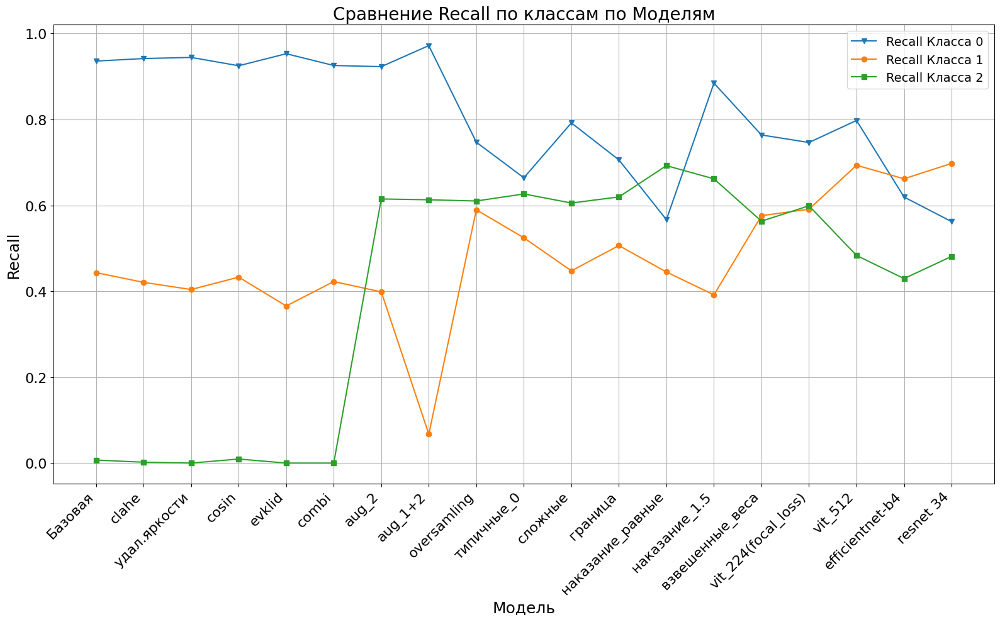

# Study of the problem of classification of eye fundus diseases using neural network architectures.

 *Master’s Thesis Project*

##  Overview
This project focuses on the automated classification of diabetic retinopathy using deep learning models. It compares various state-of-the-art architectures, such as Vision Transformers and Convolutional Neural Networks, applied to the **EyePACS** retinal fundus image dataset.

The goal is to assess the effectiveness of modern neural architectures in classifying medical images, interpret their predictions using visualization techniques (e.g., Grad-CAM), and statistically compare their performance.

---

##  Models Used
- **Vision Transformer (ViT)**
- **EfficientNet-B4**
- **ResNet-34**
-  *Custom loss function*: Focal Loss
-  *Interpretability*: Grad-CAM visualizations
-  *Statistical comparison*: Critical Difference Diagrams, Friedman Test

---

##  Project Structure
├── training_file/

│ └── *.ipynb - Jupyter Notebooks for training all models

├── testing_file/

│ └── *.ipynb - Notebooks for evaluation, metrics, visualizations (Grad-CAM)

├── preprocessing/

│ └── *.ipynb - Dataset cleaning, augmentation, and preparation scripts

├── README.md


---

## Technologies
- Python 3.10
- PyTorch & Torchvision
- Transformers (HuggingFace)
- Matplotlib, Seaborn, Scikit-learn
- Grad-CAM
- Pandas & NumPy
- EyePACS Dataset

---

## Getting Started

>  Note: The project is Jupyter-based. Make sure you have a working Python environment with JupyterLab or Jupyter Notebook.

1. **Clone the repository**
   ```bash
   git clone https://github.com/<your-username>/diabetic_eyepacs.git
   cd diabetic_eyepacs

---

## Результаты

В рамках работы были проведены эксперименты по классификации заболеваний глазного дна с использованием различных методов предобработки, балансировки классов и моделей нейронных сетей. Ниже представлены результаты по показателю **Recall** для каждого из классов (здоровый глаз, непролиферативная ретинопатия и пролиферативная ретинопатия) для различных моделей и этапов предобработки данных.

### Основные этапы улучшения классификации:

1. **Очистка данных**: Были протестированы различные методы очистки данных, такие как CLAHE, удаление по яркости, фильтрация по косинусному расстоянию и др.
2. **Балансировка классов**: Использовались стратегии, такие как случайное удаление изображений, удаление "типичных" эмбеддингов и сохранение только сложных случаев.
3. **Дообучение модели**: Модель была дообучена на сложных примерах, таких как ошибки модели и случаи с низкой уверенностью, с использованием взвешенных весов и focal loss.

### График результатов:

На графике ниже показаны значения **Recall** для моделей на различных этапах обработки данных по классам **здоровый глаз (0)**, **непролиферативная ретинопатия (1)** и **пролиферативная ретинопатия (2)**. Это позволяет оценить влияние каждой стратегии на чувствительность модели к каждому из классов.



### Выводы:

* Улучшение качества и структуры обобщающей выборки позволяет повысить чувствительность модели к патологическим случаям и сбалансировать поведение модели между тремя классами. 

